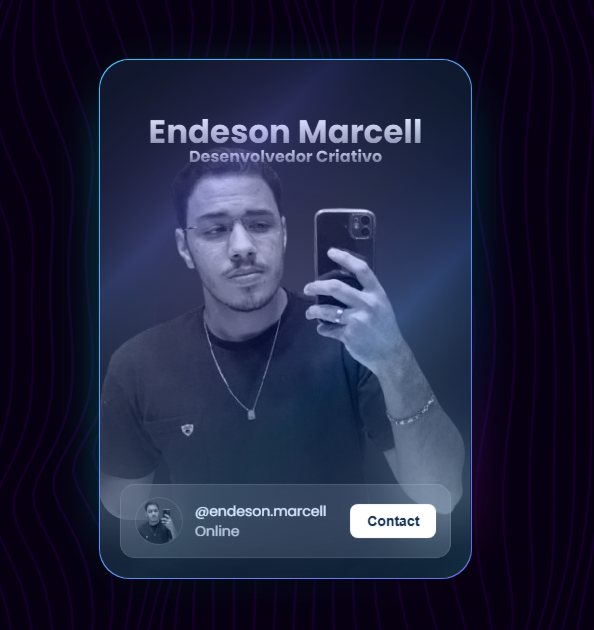

# Portfólio Criativo

[](https://github.com/endeson12/portfolio-criativo/actions/workflows/ci.yml)
[](https://react.dev/)
[](https://vite.dev/)

Portfólio experimental criado para explorar interfaces interativas, motion design e efeitos gráficos no navegador.

**Aplicação publicada:** [endesonportifolio.netlify.app](https://endesonportifolio.netlify.app/)



## O que o projeto demonstra

- composição de componentes reutilizáveis em React;
- animações com Framer Motion e GSAP;
- rolagem suave e microinterações;
- efeitos gráficos com OGL/WebGL;
- galeria circular e cartões interativos;
- layout responsivo e publicação contínua no Netlify.

## Tecnologias

- React 19
- Vite 7
- Framer Motion
- GSAP
- Lenis
- OGL
- ESLint
- GitHub Actions

## Execução local

Requisitos: Node.js 20 ou superior.

```bash
git clone https://github.com/endeson12/portfolio-criativo.git
cd portfolio-criativo
npm ci
npm run dev
```

A aplicação estará disponível no endereço informado pelo Vite, normalmente `http://localhost:5173`.

## Verificação

```bash
npm run lint
npm run build
```

O workflow de CI executa as verificações a cada atualização da branch principal.

## Limitações atuais

- o formulário prepara a mensagem no cliente de e-mail do visitante; não há armazenamento no servidor;
- algumas experiências gráficas podem exigir mais processamento em dispositivos antigos;
- o conteúdo dos projetos apresentados é estático.

## Contato

- [GitHub](https://github.com/endeson12)
- [E-mail](mailto:endesonmarcell@gmail.com)
